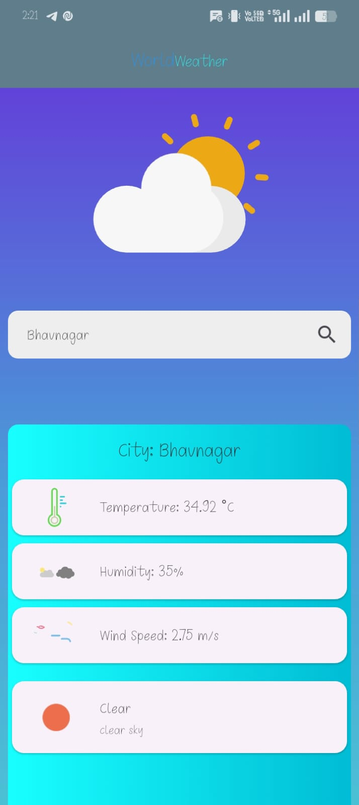
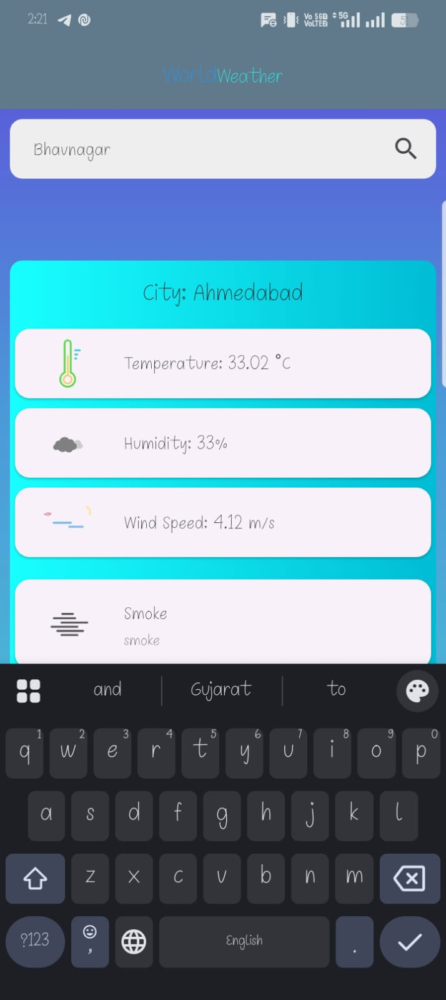
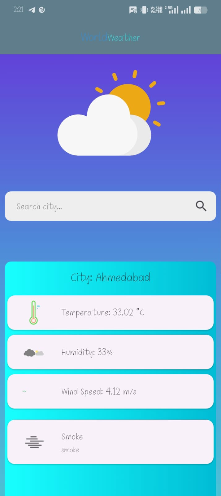

# 🌦️ Flutter Weather App

A modern and responsive **Weather Application built with Flutter** that provides real-time weather updates using API integration. The app allows users to search any **city, place, or state** and view detailed weather information with smooth UI and animations.

---

## 🚀 Features

* 🔍 Search weather by **city, place, or state**
* 🌡️ Display **temperature**
* 💧 Show **humidity level**
* 🌬️ Show **wind speed**
* ☁️ Weather conditions (Clear, Cloudy, Foggy, etc.)
* 🎬 Beautiful **Splash Screen using Lottie animation**
* 🎨 Animated weather icons using Lottie
* ⚡ Fast and responsive UI
* ❗ Error handling for invalid city search

---

## 🛠️ Tech Stack

* **Flutter (Dart)**
* **REST API Integration**
* **JSON Parsing**
* **Lottie Animations**

---

## 📱 UI Highlights

* 🌤️ Cloud animation above search bar (Lottie)
* 🔎 Animated search icon
* 🎨 Dynamic UI based on weather conditions
* ✨ Smooth splash screen animation

---

## 📸 Screenshots

> Add your app screenshots below

## 📸 Screenshots

<p align="center">
  
  
  
</p>

<p align="center">
  
  
</p>

## 🎥 Demo Video


## ⚙️ Installation

1. Clone the repository:

```
git clone https://github.com/your-username/weather-app.git
```

2. Navigate to project folder:

```
cd weather-app
```

3. Install dependencies:

```
flutter pub get
```

4. Run the app:

```
flutter run
```

---

## 🔑 API Setup

* Get your API key from weather provider
* Add your API key in the project

Example:

```dart
 // you can easiliy Api key
```

---

## 📂 Project Structure

```
lib/
 ┣ screens/
 ┗ main.dart
```

---

## 💡 Future Improvements

* 📍 Auto-detect current location
* 🌍 7-day weather forecast
* 🌙 Dark/Light mode
* 📊 Weather graphs
* 🔔 Weather alerts

---

## 🤝 Contributing

Contributions are welcome! Feel free to fork this repo and submit a pull request.

---

## ⭐ Support

If you like this project, give it a ⭐ on GitHub!

---

## 📧 Contact

Your Name - [makwanay324@gmail.com](mailto:makwanay324@gmail.com)
GitHub - https://github.com/Yogesgmakvana

---
